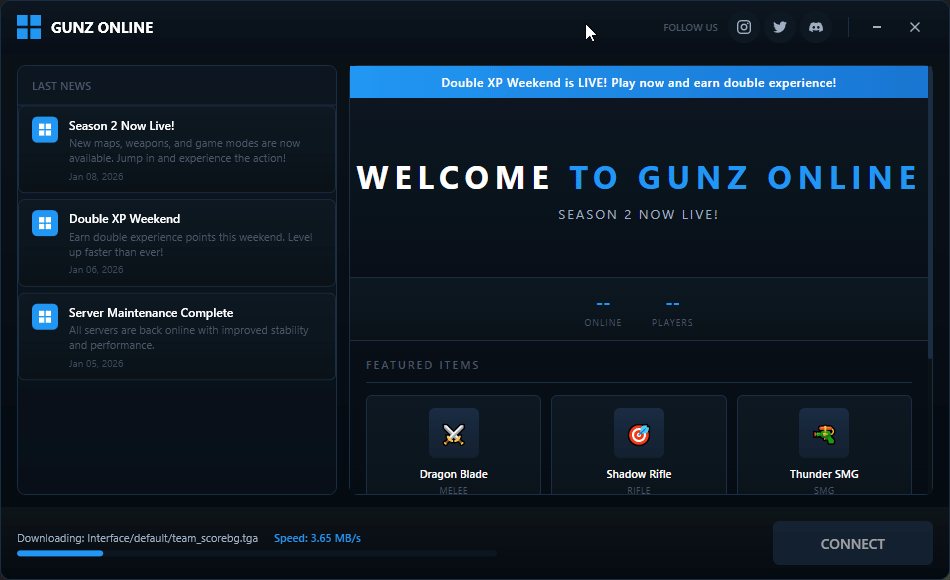
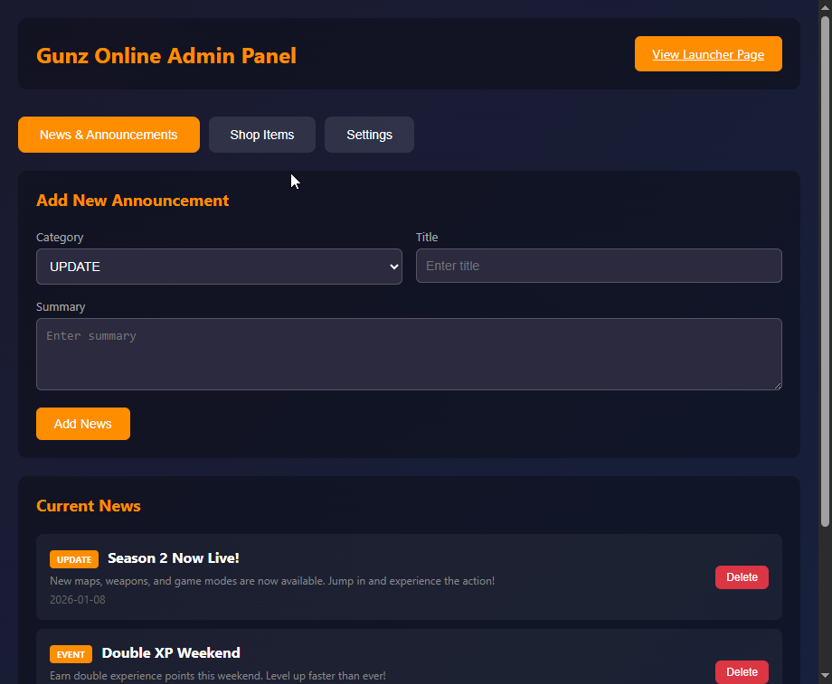

# Gunz Launcher & Updater



A modern, dark-themed game launcher and auto-updater system for Gunz Online private servers. Features a sleek WPF interface with WebView2 integration, automatic patch management, and a PHP-based content management system.

**Created by ZxPwd**

---

## Admin Panel - For the GunzWebLauncher DATA



Manage your launcher content through a simple web-based admin panel. Add announcements, news articles, featured shop items, and configure server statistics.

---

## Overview

This is a **3-part project** designed to work together:

| Component | Description |
|-----------|-------------|
| **GameUpdater** | WPF-based game launcher with auto-update functionality |
| **makeupdate** | Patch generator tool that creates `patch.json` for the updater |
| **GunzWeb** | PHP/JSON CMS that displays content inside the launcher |

---

## Features

- Modern dark flat UI with gradient effects
- Automatic game file verification and updates
- SHA256 hash-based file integrity checking
- Download progress with speed display
- Embedded web content panel (WebView2)
- News feed from JSON API
- Social media integration (Discord, Twitter, Instagram)
- Single-file executable deployment
- No external config files (hardcoded for security)

---

## Project Structure

```
Gunz-Launcher-Updater/
├── GameUpdater/           # WPF Launcher Application
│   ├── GameUpdater/       # Source code
│   └── publish/           # Compiled executable
├── makeupdate/            # Patch Generator Tool
│   └── MakeUpdate.exe     # Generates patch.json
├── GunzWeb/               # PHP Web Content System
│   ├── api/               # REST API endpoints
│   ├── admin/             # Admin panel
│   └── data/              # JSON data storage
├── preview.gif            # Launcher preview image
└── admin-preview.gif      # Admin panel preview image
```

---

## Quick Start Guide

### Step 1: Set Up Your Web Server

1. Copy the `GunzWeb` folder to your web server (e.g., `htdocs/GunzWeb` for XAMPP)
2. Ensure PHP is enabled on your server
3. Access the admin panel at: `http://yourserver/GunzWeb/admin/`
4. Default credentials: `admin` / `admin123`
5. Configure your settings, add news items, and featured shop items

### Step 2: Generate Your Patch File

1. Place your game files in a folder (e.g., `C:\GameFiles\`)
2. Run `makeupdate/MakeUpdate.exe`
3. Enter the path to your game files
4. Enter your update base URL (e.g., `http://yourserver/gunz/update/`)
5. The tool will generate `patch.json` with SHA256 hashes of all files
6. Upload `patch.json` and all game files to your web server

**Example folder structure on web server:**
```
/gunz/
├── patch.json           # Generated by makeupdate
└── update/              # Your game files
    ├── Gunz.exe
    ├── system.mrs
    └── ...
```

### Step 3: Configure the Launcher

Edit the configuration in `GameUpdater/GameUpdater/Configuration/LauncherConfig.cs`:

```csharp
public static class LauncherConfig
{
    // Update URLs - Point these to your server
    public static string PatchUrl => "http://yourserver/gunz/patch.json";
    public static string UpdateBaseUrl => "http://yourserver/gunz/update/";

    // GunzWeb URL - Shows content in the launcher
    public static string WebContentUrl => "http://yourserver/GunzWeb/";

    // News API
    public static string NewsUrl => "http://yourserver/GunzWeb/api/news.php";

    // Game executable name
    public static string GameExecutable => "Gunz.exe";

    // Social Links
    public static string DiscordUrl => "https://discord.gg/yourserver";
    public static string TwitterUrl => "https://twitter.com/yourserver";
    public static string InstagramUrl => "https://instagram.com/yourserver";
    public static string WebsiteUrl => "https://yourwebsite.com";
}
```

### Step 4: Build the Launcher

```bash
cd GameUpdater/GameUpdater
dotnet publish -c Release -r win-x64 --self-contained true -p:PublishSingleFile=true -o "../publish"
```

The compiled `GameUpdater.exe` will be in the `publish` folder.

---

## Detailed Component Documentation

### GameUpdater (Launcher)

The launcher is built with:
- **.NET 8.0 WPF** - Modern Windows desktop framework
- **WebView2** - Microsoft Edge-based browser control
- **MVVM Architecture** - Clean separation of concerns

**Key Files:**
- `Configuration/LauncherConfig.cs` - All hardcoded URLs and settings
- `Services/UpdateService.cs` - Handles patch checking and file updates
- `Services/DownloadService.cs` - Async file downloads with progress
- `Services/HashService.cs` - SHA256 file verification
- `Views/MainWindow.xaml` - Main UI layout

**How Updates Work:**
1. Launcher downloads `patch.json` from your server
2. Compares SHA256 hashes of local files vs server files
3. Downloads only files that are missing or changed
4. Shows progress bar and download speed
5. Enables "CONNECT" button when ready

---

### makeupdate (Patch Generator)

A console application that scans your game files and generates `patch.json`.

**Usage:**
```
MakeUpdate.exe
> Enter game files path: C:\GameFiles
> Enter update base URL: http://yourserver/gunz/update/
> Generating patch.json...
> Done! patch.json created.
```

**Output Format (patch.json):**
```json
{
  "version": "1.0.0",
  "files": [
    {
      "path": "Gunz.exe",
      "hash": "a1b2c3d4e5f6...",
      "size": 1234567,
      "url": "http://yourserver/gunz/update/Gunz.exe"
    }
  ]
}
```

---

### GunzWeb (Content Management)

A lightweight PHP/JSON CMS that displays inside the launcher.

**Admin Panel Features:**
- Edit banner text and subtitle
- Toggle announcement bar
- Manage news articles
- Manage featured shop items
- Configure player statistics

**API Endpoints:**
| Endpoint | Description |
|----------|-------------|
| `/api/settings.php` | Server settings and banner config |
| `/api/news.php` | News articles list |
| `/api/shop.php?featured=true` | Featured shop items |

**Data Storage:**
All data is stored in JSON files in the `/data/` folder:
- `settings.json` - Server configuration
- `news.json` - News articles
- `shop.json` - Shop items

---

## URL Configuration Reference

| Setting | Description | Example |
|---------|-------------|---------|
| `PatchUrl` | URL to your patch.json file | `http://server/gunz/patch.json` |
| `UpdateBaseUrl` | Base URL for game file downloads | `http://server/gunz/update/` |
| `WebContentUrl` | URL to GunzWeb index | `http://server/GunzWeb/` |
| `NewsUrl` | API endpoint for news | `http://server/GunzWeb/api/news.php` |
| `GameExecutable` | Name of main game exe | `Gunz.exe` |

---

## Customization

### Changing Colors

Edit `GameUpdater/Themes/Colors.xaml` to customize the color scheme:
- Primary backgrounds: `#070D15`, `#0C1824`
- Accent color: `#2196F3` (blue)
- Text colors: `#FFFFFF`, `#A0AEC0`, `#4A5568`

### Changing the Logo

Replace the logo icon in `GameUpdater/Themes/Icons.xaml` (SVG path data).

### GunzWeb Styling

Edit the `<style>` section in `GunzWeb/index.php` to match your branding.

---

## Requirements

**For Building:**
- .NET 8.0 SDK
- Visual Studio 2022 or VS Code

**For Running:**
- Windows 10/11
- WebView2 Runtime (auto-installed with Edge)

**For GunzWeb:**
- PHP 7.4+ enabled web server
- Apache/Nginx/IIS

---

## Troubleshooting

**Launcher shows "Unable to check for updates"**
- Verify your `PatchUrl` is accessible
- Check that `patch.json` is valid JSON

**WebView2 not loading**
- Ensure WebView2 Runtime is installed
- Check `WebContentUrl` is correct and accessible

**Downloads fail**
- Verify `UpdateBaseUrl` points to the correct folder
- Ensure all files listed in `patch.json` exist on server

**GunzWeb admin not working**
- Check PHP is enabled
- Verify `/data/` folder has write permissions

---

## License

This project is provided as-is for educational and private server use.

---

## Credits

**Created by ZxPwd**

- Game Launcher UI Design
- Auto-Update System
- GunzWeb CMS
- Patch Generation Tool

---

## Support

For issues and feature requests, please open an issue on GitHub.
